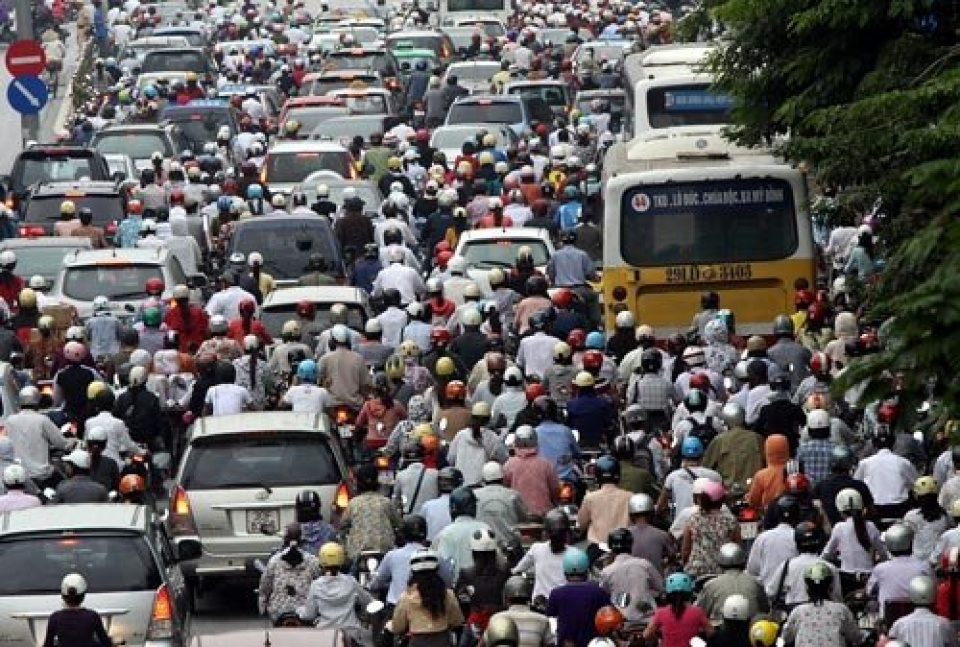

# Traffic-Detection
Phần mềm phân loại hình ảnh sử dụng Keras và OpenCV trên ngôn ngữ Python để phân loại xem tuyến đường có kẹt xe hay không.

### I. Nghiên cứu và áp dụng công nghệ phân loại hình ảnh (Image-classifier) sử dụng Python và thư viện máy học Keras.

#### Các thư viện cần thiết (Dependencies)
  - numpy
  - tensorflow
  - keras
  - opencv
 
#### Mạng lưới CNN/ ConvNeural Net và giả thiết xây dựng một CNN để nhận biết kẹt xe.
  CNN là mạng lưới/ thuật toán gồm các neuron và các bước xử lý hình ảnh để máy tính có thể phân loại hình ảnh. Ngoài ra, CNN còn được áp dụng trong các thuật toán nhận biết đồ vật (Object-detection) để phân loại đồ vật.
  CNN được cấu tạo từ nhiều lớp khác nhau, trong đó, 3 lớp cơ bản và cần thiết nhất để hình thành một cấu trúc CNN là:
  
    1. Convolution.
    2. MaxPool.
    3. Fully-connected (Dense).
    
  Từ các lớp trên, ta hình thành được cấu trúc cơ bản nhất.
  
    (INPUT - CONVlayer - MaxPoollayer - Dense - OUTPUT)
    
  INPUT [80x80x1]:
  
  - Là hình ảnh được nhận vào mạng lưới để phân loại. Để phục vụ mục đích nghiên cứu, ta sẽ giới hạn loại dữ liệu nhận vào CNN của chúng ta xuống hai loại: đường kẹt xe và đường không kẹt xe, và độ phân giải của các hình ảnh này sẽ là 80x80, màu trắng đen (nếu biểu diễn trên máy tính, ta chỉ cần 1 mảng ma trận biểu diễn độ sáng tối của ảnh, không cần đến 3 lớp biểu diễn ba màu cơ bản đỏ, lục, lam )  khi nhập vào để hợp với khả năng xử lý trên máy tính thử nghiệm, như vậy, ảnh của chúng ta sẽ được biểu diễn bằng ma trận [80x80x1]  .**Lưu ý rằng các hình ảnh dữ liệu sẽ phần lớn là hình được chụp ở Việt Nam do phần mềm chỉ phục vụ nhận biết kẹt xe ở Việt Nam. Ngoài ra, không có tiêu chí để phân loại như thế nào là kẹt xe, CNN này sẽ hoạt động dựa trên cách chúng ta nhận biết kẹt xe qua các đặc điểm chung (xe nhiều, giao thông đặc, v.v)**
  
  **CONVlayer:**
  
  - Lớp xử lý hình ảnh và xây dựng neuron đầu tiên trong mạng lưới CNN của chúng ta. Convolution là bước tính toán và xuất ra dữ liệu của một phần của ảnh (ROI: Region of image) bằng các kernel hay filter duyệt qua mọi pixel trên ảnh (để hiểu rõ hơn về cách hoạt động của các filter này, các bạn nên ghé thăm trang http://setosa.io/ev/image-kernels/ để thử nghiệm và nghiên cứu output sau khi một hình ảnh được xử lý bởi một filter). Sau đó, hình ảnh xuất ra sẽ là một hình ảnh xử lý đã được làm rõ các đặc tính chính. Điều này sẽ đưa ra x output khác nhau, với x là số filter mà chúng ta chọn. Như vậy, chúng ta sẽ có một ma trận với độ lớn [80x80xX] để biểu diễn hình ảnh mới được xử lý này .
  
  **MaxPool:**
  
  - Lớp pool sẽ thực hiện một bước extract các đặc tính nổi bật nhất của dữ liệu và bỏ đi các dữ liệu không liên quan băng cách tương tự với lớp CONV, chạy một filter qua khắp ảnh, mỗi ROI mà filter đó chạy qua, lấy giá trị lớn nhất trong ROI đó (tương đương với việc chọn các đặc tính nổi bật nhất), như vậy lớp dữ liệu mới của chúng ta sẽ có ma trận [40x40xX]. Nhưng trước khi qua bước này, chúng ta còn phải đưa dữ liệu từ lớp CONV qua một hàm kích hoạt, để tiện, ta sẽ sử dụng hàm RELU (Rectified Linear unit) là hàm kích hoạt đặc trưng cho mọi lớp. Một hàm kích hoạt sẽ dựa vào trọng lượng của các neuron (hay trong trường hợp này là các pixel) để tính toán, nếu phép tính vượt qua một định mức nào đó, dữ liệu này sẽ ảnh hưởng đến kết quả nhận biết hình ảnh cuối cùng, nếu không, neuron này sẽ bị bỏ qua.
  
  **Dense:**
  
  -
  

  
