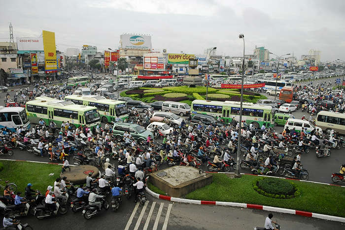
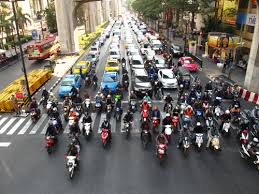
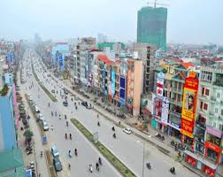
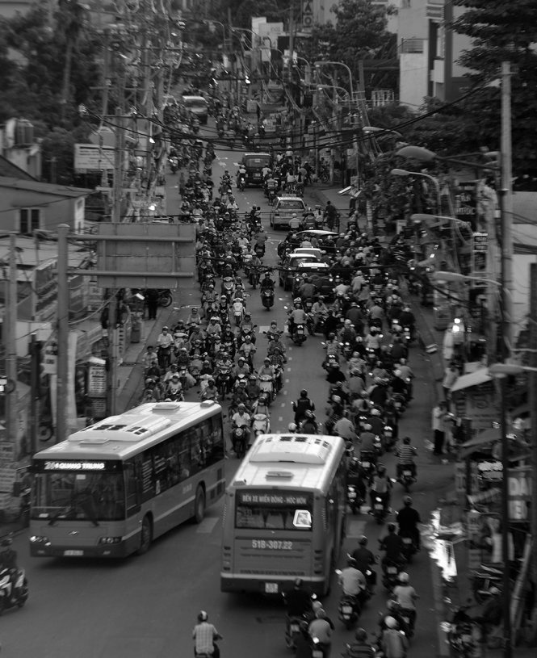

# Traffic-Detection
Phần mềm phân loại hình ảnh sử dụng Keras và OpenCV trên ngôn ngữ Python để phân loại xem tuyến đường có kẹt xe hay không.


## I. Nghiên cứu và áp dụng công nghệ phân loại hình ảnh (Image-classifier) sử dụng Python và thư viện máy học Keras.

### Các thư viện cần thiết (Dependencies)
  - numpy
  - tensorflow
  - keras
  - opencv
 
### Xây một mạng lưới CNN/ ConvNeural Net và giả thiết xây dựng một CNN để nhận biết kẹt xe.
  CNN là mạng lưới/ thuật toán gồm các neuron và các bước xử lý hình ảnh để máy tính có thể phân loại hình ảnh. Ngoài ra, CNN còn được áp dụng trong các thuật toán nhận biết đồ vật (Object-detection) để phân loại đồ vật.
  CNN được cấu tạo từ nhiều lớp khác nhau, trong đó, 3 lớp cơ bản và cần thiết nhất để hình thành một cấu trúc CNN là:
  
    1. Convolution.
    2. MaxPool.
    3. Fully-connected (Dense).
    
  Từ các lớp trên, ta hình thành được cấu trúc cơ bản nhất.
  
    (INPUT - CONVlayer - MaxPoollayer - Dense - OUTPUT)
    
  INPUT [80x80x1]:
  
  - Là hình ảnh được nhận vào mạng lưới để phân loại. Để phục vụ mục đích nghiên cứu, ta sẽ giới hạn loại dữ liệu nhận vào CNN của chúng ta xuống hai loại: đường kẹt xe và đường không kẹt xe, và độ phân giải của các hình ảnh này sẽ là 80x80, màu trắng đen (nếu biểu diễn trên máy tính, ta chỉ cần 1 mảng ma trận biểu diễn độ sáng tối của ảnh, không cần đến 3 lớp biểu diễn ba màu cơ bản đỏ, lục, lam )  khi nhập vào để hợp với khả năng xử lý trên máy tính thử nghiệm, như vậy, ảnh của chúng ta sẽ được biểu diễn bằng ma trận [80x80x1]  .**Lưu ý rằng các hình ảnh dữ liệu sẽ phần lớn là hình được chụp ở Việt Nam do phần mềm chỉ phục vụ nhận biết kẹt xe ở Việt Nam. Ngoài ra, không có tiêu chí để phân loại như thế nào là kẹt xe, CNN này sẽ hoạt động dựa trên cách chúng ta nhận biết kẹt xe qua các đặc điểm chung (xe nhiều, giao thông đặc, v.v)**
  
  **CONVlayer:**
  
  - Lớp xử lý hình ảnh và xây dựng neuron đầu tiên trong mạng lưới CNN của chúng ta. Convolution là bước tính toán và xuất ra dữ liệu của một phần của ảnh (ROI: Region of image) bằng các kernel hay filter duyệt qua mọi pixel trên ảnh (để hiểu rõ hơn về cách hoạt động của các filter này, các bạn nên ghé thăm trang http://setosa.io/ev/image-kernels/ để thử nghiệm và nghiên cứu output sau khi một hình ảnh được xử lý bởi một filter). Sau đó, hình ảnh xuất ra sẽ là một hình ảnh xử lý đã được làm rõ các đặc tính chính. Điều này sẽ đưa ra x output khác nhau, với x là số filter mà chúng ta chọn. Như vậy, chúng ta sẽ có một ma trận với độ lớn [80x80xX] để biểu diễn hình ảnh mới được xử lý này .
  
  **MaxPool:**
  
  - Lớp pool sẽ thực hiện một bước extract các đặc tính nổi bật nhất của dữ liệu và bỏ đi các dữ liệu không liên quan băng cách tương tự với lớp CONV, chạy một filter qua khắp ảnh, mỗi ROI mà filter đó chạy qua, lấy giá trị lớn nhất trong ROI đó (tương đương với việc chọn các đặc tính nổi bật nhất), như vậy lớp dữ liệu mới của chúng ta sẽ có ma trận [40x40xX]. Nhưng trước khi qua bước này, chúng ta còn phải đưa dữ liệu từ lớp CONV qua một hàm kích hoạt, để tiện, ta sẽ sử dụng hàm RELU (Rectified Linear unit) là hàm kích hoạt đặc trưng cho mọi lớp. Một hàm kích hoạt sẽ dựa vào trọng lượng của các neuron (hay trong trường hợp này là các pixel) để tính toán, nếu phép tính vượt qua một định mức nào đó, dữ liệu này sẽ ảnh hưởng đến kết quả nhận biết hình ảnh cuối cùng, nếu không, neuron này sẽ bị bỏ qua.
  
  **Dense:**
  
  - Là loại lớp cuối cùng trong cấu trúc CNN. Dense, như tên gọi, sẽ kết nối đặc tất cả các neuron ở lớp này với lớp tiếp theo. Làm như thế sẽ tăng sức chứa và độ chính xác của model này rất mạnh, bởi vì có càng nhiều liên kết giữa các neuron sẽ càng có nhiều cách để miêu tả được dữ liệu nhập vào mạng lưới và đồng nghĩa bước phân loại cuối cùng sẽ chi tiết hơn. Nhưng, các cấu trúc CNN rất thường gặp trường hợp overfitting, do được nhận quá nhiều dữ liệu không liên quan trong hình ảnh có thể ảnh hưởng rất lớn đên khả năng phân loại sau này. Vì thế, chúng ta cần thêm bước Dropout, loại bỏ các liên kết ngẫu nhiên trong mạng lưới để tránh các lỗi không mong muốn.
  
  ### Data:
  
  Muốn xây dựng một mạng lưới CNN nói riêng, hay muốn xây dựng bất kì neural network nào, bước đầu tiên luôn luôn là chuẩn bị dữ liệu. Do CNN là một mạng lưới tự học và tự động phân loại hình ảnh, nên chúng ta phải luyện cho nó cách phân loại bằng cách chọn lọc một cơ sở dữ liệu gồm rất nhiều hình ảnh và đối tượng cần phân loại tự động, gắn mác nó, và cho nó vào mạng lưới dưới dạng input được xử lý, phương pháp này gọi là supervised learning, ta cho vào một lượng input cực lớn được gắn mác, và mạng lưới sẽ cho ta cấu trúc tự học của nó dùng để phân loại hình ảnh. Bộ dữ liệu của chúng ta sẽ chia làm hai phần, phần test và phần train. Phần train sẽ là phần đảm nhiệm phần lớn dữ liệu, đây sẽ là input được gắn mác hình nào là kẹt xe, hình nào là không, để mạng lưới có thể học và phân loại. Sau mỗi lần train xong, mạng lưới sẽ nhận tiếp một bộ dữ liệu nhỏ hơn gọi là phần test, các bức ảnh trong phần này không được gắn mác, nên muốn biết hình nào là kẹt xe, mạng lưới phải sử dụng cấu trúc tự học mà nó đã xây dựng trong phần train để phân loại hình ảnh, từ đó, ta đo độ chính xác của mạng lưới.
  
  Khái quát qua cách chọn dữ liệu, mình đã tiến hành chọn lọc và gắn mác dữ liệu qua các buớc sau đây:
  
  - Bước 1: Download dữ liệu
  
  Ta gặp vấn đề đầu tiên, làm sao để có được lượng lớn cỡ 700-1000 hình ảnh chọn lọc về kẹt xe. Giải pháp của ta là các cơ sở dữ liệu online được tạo ra để phục vụ cho các mục đích nghiên cứu trí tuệ nhân tạo và khoa học dữ liệu lớn. Mình đã chọn ImageNet làm cơ sở để download hình ảnh không kẹt xe (đúng hơn là đường xá). Nhưng do các hình ảnh chuyên biệt về tình hình kẹt xe tại Việt Nam rất khó có thể tìm thấy trong các cơ sở dữ liệu này, mình đã xài Google Image để download hình ảnh kẹt xe với từ khoá " kẹt xe Việt Nam". Như vậy, chúng ta đã có trong tay hơn 1300 hình ảnh để cho mạng lưới train, 100 hình ảnh để test.
  
  - Bước 2: Gắn mác hình ảnh
  
  Vấn đề tiếp theo là làm sao để gắn mác hơn 1400 hình ảnh tổng cộng. Với số lượng lớn như vậy, mình đã viết một chương trình Python dựa trên một forum trên mạng dùng để gắn mác các hình ảnh này. Khi ta download về, lưu ý rằng các hình ảnh kẹt xe phải nằm riêng lẻ với các hình không kẹt xe trong hai folder khác nhau. Như vậy, ta sẽ sử dụng chương trình Labeler.py có trong repository này để gắn mác từng ảnh. Với mỗi ảnh trong folder, ta sẽ gắn mác "traffic." hoặc là "road." trước tên ảnh bằng dòng code sau:
  
  ```
  def get_traindata():
    img_num=1
    for n in os.listdir(mypath):
        path=os.path.join(mypath,n)
        img=cv2.imread(path, cv2.IMREAD_GRAYSCALE)
        cv2.imwrite('./train/'+label+str(img_num)+'.jpg',img)
        img_num+=1
  ```
  
  Với thủ tục trên, ta có label là "traffic" hoặc "road", mypath là địa chỉ folder giữ ảnh, img_num là để đếm ảnh và thêm chỉ số đếm vào tên. Như vậy, ta sẽ có:
  
  
  
  Tương tự cho folder giữ ảnh kẹt xe:
  
  
  
  
  
  
  -Bước 3: Tiền xử lý hình ảnh
  
  Như đã nói ở trên, do giới hạn nghiên cứu và khả năng xử lý của máy tính mình, ta cần các bước xử lý hình ảnh trước khi train để bộ nhớ tạm thời (RAM) của máy mình chứa nổi và CPU của mình tính toán trong thời gian hợp lý. Để vậy, ta chọn xử lý độ phân giải và màu của hình ảnh. Sau một hồi thử nghiệm giới hạn của máy, mình đã chọn được độ phản giải thích hợp nhất là 80x80, và chúng ta sẽ loại màu ra khỏi ảnh vì thứ nhất màu không cần thiết để nhận biết và phân loại kẹt xe, hai là nếu thêm màu vào, hình ảnh của chúng ta sẽ cần được biểu diễn dưới dạng mảng/ma trận ba chiều, rất tốn kém. Như vậy, ta có dữ liệu ảnh cuối cùng là [80x80x1] với 80x80 là độ phân giải, 1 là Grayscale channel, hay còn gọi là trắng đen. Ta sẽ thực hiện dòng code sau trong chương trình chính ori2.py :
  
  ```
  def get_traindata():
    img_num=0
    for n in os.listdir(mypath):
        try:
            img_num+=1
            path=os.path.join(mypath,n)
            img=cv2.imread(path, cv2.IMREAD_GRAYSCALE)
            img=cv2.resize(img, (img_rows,img_cols))
            x_train.append(np.array(img))
            y_train.append(label(n))
        except Exception as e:
            print(str(e))
            
  ```
  
  
  Ta có, mypath là địa chỉ folder nhét 1300 hình ảnh để train, imread GRAYSCALE để đọc hình ảnh dưới dạng trắng đen, resize để chỉnh hình ảnh xuống độ phân giải thích hợp ( ở đây độ phân giải được khai báo dưới biến img_rows, img_cols). Sau đó, ảnh sẽ được ép vào một list trong python và được chuyển hoá thành dạng mảng bằng thư viện numpy qua dòng x_train.append(np.array(img)).
  
  -Bước 4: Cấu trúc CNN
  
  ```
  model=Sequential()
model.add(Conv2D(32, kernel_size=(3, 3),
                 activation='relu',
                 input_shape=input_shape))
model.add(Conv2D(64, (3, 3), activation='relu'))
model.add(MaxPooling2D(pool_size=(2, 2)))
model.add(Conv2D(filters=32,kernel_size=3,strides=1,padding='same',activation='relu'))
model.add(MaxPooling2D(pool_size=5,padding='same'))
model.add(Conv2D(filters=32,kernel_size=3,strides=1,padding='same',activation='relu'))
model.add(MaxPooling2D(pool_size=5,padding='same'))
model.add(Dropout(0.25))
model.add(Flatten())
model.add(Dense(128, activation='relu'))
model.add(Dropout(0.5))
model.add(Dense(2, activation='softmax'))

  ```
  
  Ở trên là cấu trúc CNN của mình được hỗ trợ bởi thư viện Keras, ta bắt đầu cấu trúc bằng dòng Sequential(). Sau đó, cấu trúc sẽ có dạng :
  
  ```
  (INPUT - CONVLAYER(32 filters 3x3) - CONVLAYER(64 filters 3x3) -  MAXPOOL - CONVLAYER(32 filters 3x3) - MAXPOOL - CONVLAYER(32 filters 3x3) - MAXPOOL - Dropout - Dense - Dropout - Dense)
  
  ```
  
  
  
  - Bước 5: Train cấu trúc
  
  Sau khi đã chuẩn bị xong dữ liệu, đưa các bước xử lý hình ảnh, và hoàn chỉnh một cấu trúc CNN, ta cho cấu trúc train dữ liệu trên bằng cách chạy bản thử ori2.py. Ta sẽ cho mạng lưới tự học với các chỉ số sau:
  
  - epoch: Train 15 epochs, với mỗi epoch, mạng lưới sẽ chạy qua bộ dữ liệu train 1300 bức ảnh và tự điều chỉnh chính nó, ở cuối một epoch, nó sẽ test độ chính xác cấu trúc vào bộ test. Ta có thể hiểu 1 epoch như một chu kỳ.
  
  - Batch_size: batch_size của mình cũng sẽ là 15, tức là, cứ mỗi 15 bức ảnh, nó sẽ lấy dữ liệu của 15 bức ảnh đó, tự học và thay đổi các parameters và các chỉ số bên trong mạng lưới để tăng độ chính xác.
  
  Cuỗi cùng, chúng ta sẽ có loạt kết quả sau và cấu trúc hoàn chỉnh khi chạy ori2.py:
  
  
  
  Ta thấy, ở epoch thứ 15, ta có kết quả phân loại trên bộ train là 94% (acc), trên bộ test là 96% (val_acc). Nhưng, mục đích chính của nghiên cứu trí tuệ nhân tạo không phải là tối ưu độ chính xác mà là tối thiểu độ sai lệch (loss). Loss là chỉ số khác nhau giữa *dự đoán* phân loại và thực tế, không nên nhầm lẫn với độ chính xác phân loại so với thực tế, nếu nhìn qua kết quả, ta rút ra được rằng kết quả loss của chúng ta còn quá lớn, đến những 10-20%, cho nên mặc dù rất có triển vọng, ta cần phải hiểu rằng CNN vẫn có thể tối ưu được bằng những cách như chuẩn bị bộ dữ liệu lớn hơn, tối ưu cấu trúc bằng toán học hơn là thử nghiệm, có bộ vi xử lý mạnh hơn để tăng cường sức xử lý của máy tính, v.v..
  
  
  
  - Bước 6: Test trên các dữ liệu thực tế:
  Sau khi xong tất cả, mình đã chọn ra các hình ảnh không có trong bộ dữ liệu để test CNN. Ta sẽ sử dụng chương trình predict.py để thử, nếu nó là kẹt xe, chương trình sẽ xuất ra traffic, nếu không, sẽ xuất ra road. Ngoài ra, chương trình còn xuất cặp chỉ số xác suất dự đoán [x,y], tương đương ta có x là chắc chắn bao nhiêu phần trăm bức ảnh này là đường bị kẹt xe, y là bao nhiêu phần trăm chắc chắn bức ảnh này không bị kẹt xe.
  
  traffic1.jpg:
  
  
  
   Kết quả:
   
   
   
   
   index.jpeg:
   
   
   
   
   Kết quả:
   
   
   
   
   index.jpg:
   
   
   
   
   Kết quả:
   
   
   
   
   traffic.jpg:
   
   
   
   
   Kết quả:
   
   
   
   
   Như vậy, ta thấy mạng lưới CNN của chúng ta đã phân loại đúng 3 trong 4 ảnh, với ảnh thứ 2 bị phân loại sai, theo suy đoán của mình, có lẽ do mái của những chiếc xe hơi trong bức ảnh đó bị chiếu quá sáng nên ảnh bị chói, để lại phần sau con đường mặc dù bị kẹt xe nhưng lại trông rất giống một con đường trống trải.
   
   
   #### Kết luận.
   Với mục đích của mình ban đầu là xây dựng một mạng lưới CNN để nghiên cứu, học hỏi và thử nghiệm. Nhưng, do thấy sự cần thiết của việc giải quyết vấn đề kẹt xe là quá lớn nên mình quyết định thử áp dụng công nghệ này vào nhận dạng kẹt xe để đưa ra một hướng tiếp cận mới và dùng nó như sản phẩm của bài thi KHKT của mình. Sau dự án, mình thấy được rằng, mặc dù còn rất nhiều hạn chế, trí tuệ nhân tạo nói chung, CNN và công nghệ phân loại hình ảnh nói riêng, là những "thí sinh" rất có triển vọng giải quyết các vấn đề mà hiện tại ta chưa giải quyết được, chẳng hạn như kẹt xe, và nhiều mục đích khác nữa. 
  
  
  
  
  
  
  
  
  
  
  

  
